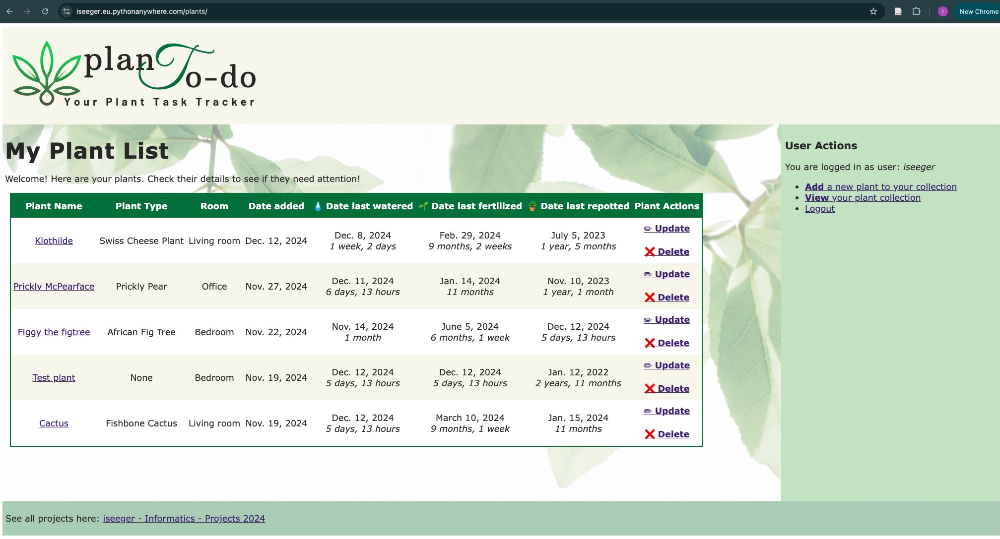
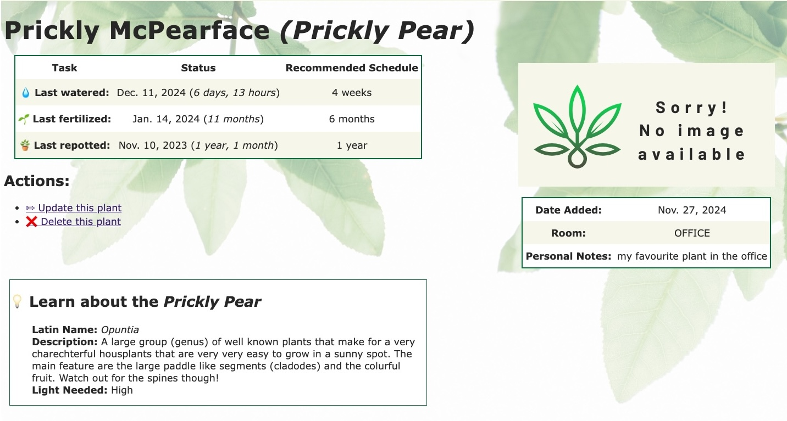

# Plant Todo App - ReadMe
_project directory: `planttracker/plants/`_

This is my first ever full stack project. It's the final project for an Informatics class on a Master's course.

The purpose of this app is a task tracker for houseplants. 
All houseplants require certain tasks (watering, fertilizing, repotting) repeatedly, so in this app, the user can:

* __login__ to see their plants
* __add__ new plants to their collection
    * they can add details such as name, location, any notes, and specify a cadence for all tasks that the plant requires
    * they can select a plant type for their plant
* __update__ an entry for a plant
    * also update any tasks when they are completed
* __delete__ a plant

Once a plant is added, the user can navigate to the plant's __detail page__ and:
* check for any tasks that are due, and when they were last completed
* see information about the plant type in the detail page
* see information such as personal notes about the plant, or an image (future development)

## Details

### Models

1. __Houseplant__: 
    * Is the reference model for the plant types. Contains 93 plant types.
    * Fields: latin name, common name, description, plant_image_url (deprecated/most no longer available), light needed
2. __Plant__:
    * is the model that contains each plant entry
    * Fields: plant type, nickname, description (personal), image, room, water schedule, fertilize schedule, repotting schedule, date last watered, date last fertilized, date last repotted, date added, date last updated

### Templates and Views
_Templates Path: `planttracker/plants/templates/plants/`_

_Views Path: `planttracker/plants/views.py`_

|   Page  |   View    |    Template    |
| ------------ | ------------ | ----------- |
| Plant list page |  MainView() | `plant_list.html` |
| Plant detail page | PlantDetailView()  | `plant_detail.html` |
| Form to add plant  | PlantCreateView() | `plant_form.html` |
| Form to update plant | PlantUpdateView()  | `plant_update.html` |
| Delete plant confirmation  | PlantDeleteView()  | `plant_confirm_delete.html` |
| Plant Update/Delete success | PlantSuccessView() | `plant_success.html` |
| User Logout | OpenView() | `logout_view.html` |

### Static Files
_Path: `planttracker/plants/static/plants/`_

* Images:
    * Image for site logo, placeholder for "no image available" on detail page, background image
* CSS file: `plantstyles.css`
* `common_houseplants_data.csv`: Source file that was converted into Houseplants model. Source: https://github.com/anjelicasilva/ispeakplantish/blob/master/seed_data/common-houseplants-data.csv 

### Helper Files
* `planttracker/plants_import.py`: Code used to import common_houseplants_data.csv into the Houseplants model.

## Future Development Plans
There are functionalities that can be implemented to improve the app further, such as:

* visual alerts when a task is overdue
* adding own photos to plants
* more flexibility in task cadence selection; hardcode recommended cadence into the Houseplant lookup model based on plant type.
* add form and view for updating the individual tasks, without having to use the full update form.
* improve layout of details page.
* improve layout for mobile view.

---------
_Author: Isabell Seeger; December 2024_

_Code or data adapted from other sources is specified in the source code and linked._
